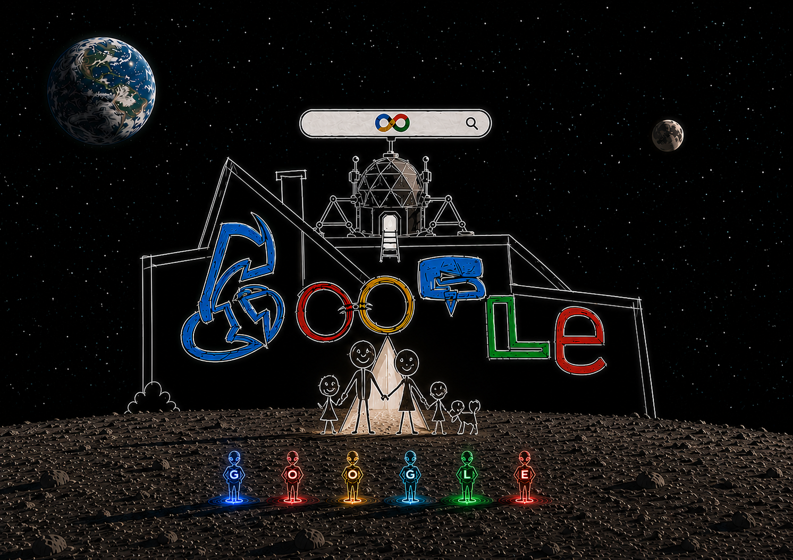

markdown

# 🚀 The Cosmic Search: A Creative Homage to Google

This repository hosts a hybrid artwork blending graphite pencil sketches with digital editing, depicting Google as a bridge for human curiosity and cosmic exploration.

## 🎨 Concept Highlights
* **Cosmic Search Bar:** Features a color-coded infinity symbol (∞) representing limitless knowledge.
* **Blueprint Text:** The "Google" typography is structurally embedded into the lunar architecture with neon-highlighted pencil textures.
* **Human & Alien Connection:** Features a minimalist family and six alien figures spelling G-O-O-G-L-E on their chests, symbolizing universal inclusion.

## 🛠️ Technical Info
* **Medium:** Hybrid Media (Graphite Pencil + Digital Post-Processing).
* **Inspiration:** Retro-futuristic storytelling, designed for the Google Doodle and creative engineering teams.

---
* **Artist:** [Ojos del Barroco Galería](https://github.com)
